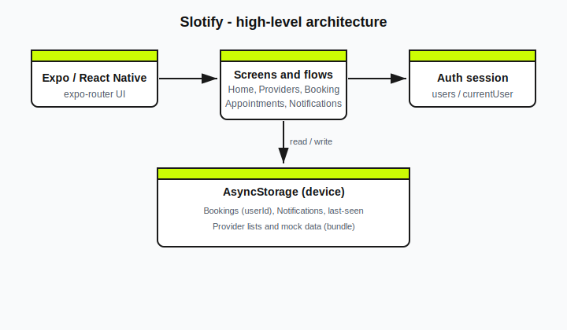

# Slotify

Slotify is a cross-platform mobile app for discovering service providers, booking appointment slots, managing visits, and tracking in-app notifications. It is built with **Expo** and **React Native**, uses **file-based routing** via **Expo Router**, and persists user-scoped data locally with **AsyncStorage**.

**Expo project:** [@ehthasham/Slotify](https://expo.dev/accounts/ehthasham/projects/Slotify)

---
## 👨‍💻 About the Developer

Hi, I’m **Ehthasham Mustafa**, a final-year B.Tech student and aspiring Software Developer passionate about building scalable applications and AI-powered solutions.

🔗 **GitHub:** https://github.com/Itz-Ehthasham  
💼 **LinkedIn:** https://linkedin.com/in/ehthasham-mustafa/  
📧 **Email:** ehthasham678@gmail.com 

---

## Download (Android APK)

Pre-built Android binaries from EAS are available on Expo:

- **[EAS build — Slotify (APK / artifacts)](https://expo.dev/accounts/ehthasham/projects/Slotify/builds/048d55dc-0a23-4633-904d-eafa5387ad97)**

Open the build page and download the **APK** (or other artifacts) provided for that build. For new builds, use the [Expo dashboard](https://expo.dev/accounts/ehthasham/projects/Slotify/builds) for your project.

---

## Features

- **Authentication** — Register and sign in; accounts stored locally; sessions tied to `currentUser`.
- **Home & providers** — Browse services and provider profiles with booking CTAs.
- **Booking** — Calendar-style slot selection, address capture (home/work), and confirmation flow.
- **Appointments** — Pending vs history, per-user list, detail modals, cancellation with confirmation UI.
- **Notifications** — Booking and cancellation events; unread indicator on the tab; per-user storage and “last seen” tracking.

---

## Tech stack

| Area | Technology |
|------|------------|
| Framework | Expo SDK ~54, React 19, React Native 0.81 |
| Navigation | Expo Router 6, React Navigation 7 |
| Language | TypeScript |
| Local persistence | `@react-native-async-storage/async-storage` |
| UI | React Native primitives, `expo-image`, `@expo/vector-icons` |

---

## Architecture

High-level data flow: **native UI** → **screens** → **storage helpers** → **AsyncStorage** (bookings and notifications scoped by `userId` / email).



---

## Prerequisites

- **Node.js** (LTS recommended)
- **npm** (comes with Node)
- For device runs: **Expo Go** or a development build; for native builds: **EAS CLI** and Android Studio / Xcode as per [Expo docs](https://docs.expo.dev/)

---

## Getting started

### Install

```bash
npm install
```

### Run the dev server

```bash
npx expo start
```

Then press:

- **a** — Android emulator / device  
- **i** — iOS simulator (macOS)  
- **w** — web (if configured)

Or scan the QR code with Expo Go.

### Lint

```bash
npm run lint
```

---

## Project structure (overview)

| Path | Role |
|------|------|
| `app/` | Expo Router routes (tabs, auth, provider flows) |
| `src/screens/` | Screen implementations |
| `src/components/` | Reusable UI (modals, cards, booking UI) |
| `src/storage/` | AsyncStorage access (bookings, notifications) |
| `src/auth/` | Session helpers (`users`, `currentUser`) |
| `src/data/` | Static / mock provider and service data |
| `assets/` | Icons, images, SVGs |

---

## Configuration

- **App config:** `app.json` — name `Slotify`, scheme `slotify`, Android package `com.ehthasham.Slotify`.
- **EAS:** `eas.json` — build profiles for Expo Application Services.

---

## Scripts

| Command | Description |
|---------|--------------|
| `npm start` | Start Expo (`expo start`) |
| `npm run android` | Start with Android |
| `npm run ios` | Start with iOS |
| `npm run web` | Start web |
| `npm run lint` | Run ESLint (app + src) |
| `npm run reset-project` | Reset starter layout (see script; use with care) |

---

## Security note

Credentials and booking data are stored **locally** for development and demos. For production, replace local auth with a secure backend, encrypt sensitive fields, and avoid storing passwords in plain text.

---

## License

Private project — all rights reserved unless otherwise specified by the owner.
